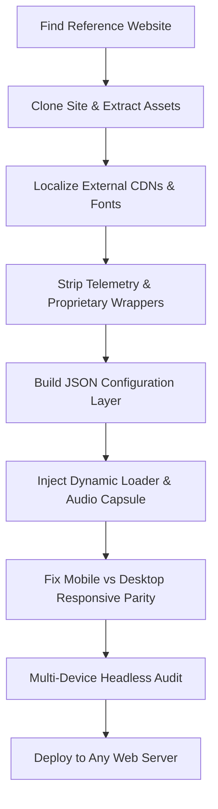

# Wedding Invitation Website: Architecture, Features & Cloning Blueprint

> **Document Purpose**:  
> This document serves as the complete technical specification, feature catalog, historical changelog, and replication blueprint for this wedding invitation website. It details all features currently present in the site, all modifications and engineering fixes applied to the original cloned codebase, and provides a step-by-step methodology for cloning and customizing any similar website.

---

## Table of Contents
1. [Project Origin & High-Level Plan](#1-project-origin--high-level-plan)
2. [Complete Site Features & Functional Specification](#2-complete-site-features--functional-specification)
   - [Visual & Artistic Design](#21-visual--artistic-design)
   - [Interactive Music & Speed Controller Capsule](#22-interactive-music--speed-controller-capsule)
   - [Cinematic Smart Auto-Scroll Engine](#23-cinematic-smart-auto-scroll-engine)
   - [Lord Murugan Shrine & Mantra](#24-lord-murugan-shrine--mantra)
   - [Desktop & Mobile Invitation Typography](#25-desktop--mobile-invitation-typography)
   - [Dual Venue Location Cards with Maps](#26-dual-venue-location-cards-with-maps)
   - [Live Interactive Countdown Timer](#27-live-interactive-countdown-timer)
   - [Direct WhatsApp RSVP Integration](#28-direct-whatsapp-rsvp-integration)
   - [Couple Story & Instagram Gallery Section](#29-couple-story--instagram-gallery-section)
3. [Comprehensive Changelog & Technical Overhaul](#3-comprehensive-changelog--technical-overhaul)
   - [Phase 1: De-Framerization & Zero External Dependencies](#31-phase-1-de-framerization--zero-external-dependencies)
   - [Phase 2: Project Restructuring & Naming Standardization](#32-phase-2-project-restructuring--naming-standardization)
   - [Phase 3: Configuration-Driven Content Architecture](#33-phase-3-configuration-driven-content-architecture)
   - [Phase 4: Responsive Design & Layout Parity Fixes](#34-phase-4-responsive-design--layout-parity-fixes)
   - [Phase 5: Audio, Auto-Scroll & Touch Isolation](#35-phase-5-audio-auto-scroll--touch-isolation)
   - [Phase 6: Heritage Theme Architecture & Visual Parity Replication](#36-phase-6-heritage-theme-architecture--visual-parity-replication)
4. [Project File Structure & Component Roles](#4-project-file-structure--component-roles)
5. [The Replication Blueprint: How to Clone & Customize Any Similar Site](#5-the-replication-blueprint-how-to-clone--customize-any-similar-site)
   - [Step 1: Cloning & Downloading the Reference Site](#step-1-cloning--downloading-the-reference-site)
   - [Step 2: Localizing External Assets (Fonts, Images, Audio)](#step-2-localizing-external-assets-fonts-images-audio)
   - [Step 3: Stripping Telemetry, Trackers & Proprietary Wrappers](#step-3-stripping-telemetry-trackers--proprietary-wrappers)
   - [Step 4: Decoupling Hardcoded Content into a JSON Config](#step-4-decoupling-hardcoded-content-into-a-json-config)
   - [Step 5: Implementing the Dynamic Client Loader & Auto-Scroll](#step-5-implementing-the-dynamic-client-loader--auto-scroll)
   - [Step 6: Resolving Mobile vs Desktop Parity & Scaling Glitches](#step-6-resolving-mobile-vs-desktop-parity--scaling-glitches)
   - [Step 7: Automated Multi-Device Auditing & Deployment](#step-7-automated-multi-device-auditing--deployment)
6. [Server Deployment Guide](#6-server-deployment-guide)

---

## 1. Project Origin & High-Level Plan

### The Concept
The project began with discovering an elegant wedding invitation website built with Framer (originally titled *"Kiran Weds Rahul"*). The reference site featured rich visual aesthetics: a South Indian temple theme, vibrant Gopuram artwork, traditional floral illustrations, and smooth scroll transitions.

### The Objective
Instead of relying on third-party design tools, expensive hosting subscriptions, or brittle external CDN servers, the goal was to:
1. **Clone & Extract** the website's complete front-end code and assets.
2. **De-couple from Third-Party CDNs**: Eliminate all external dependencies (`framerusercontent.com`, `events.framer.com`, `fonts.gstatic.com`, analytics, and tracking scripts) so the project runs 100% locally and offline.
3. **Convert into a Data-Driven Engine**: Replace all hardcoded couple names, families, dates, venues, coordinates, and RSVP links with a centralized configuration file (`wedding_config.json`) and automated synchronizer (`update_wedding.py`).
4. **Fix All Mobile & Responsive Flaws**: Solve severe mobile rendering bugs in the original template (e.g., microscopic text scaling, overlapping elements, clipped strings, off-center headers, unaligned countdown timers).
5. **Add Interactive Features**: Implement a floating music widget with speed toggles (1x / 2x), intelligent auto-scrolling with touch interrupt handling, live ticking countdown, dual venue cards with Google Maps links, and direct WhatsApp RSVP.
6. **Package as a Portable Web Standard**: Create a clean, standard directory layout (`index.html` root, `assets/` subfolders) that deploys effortlessly to any web server (Apache, Nginx, GitHub Pages, Firebase, S3, Netlify, Vercel).

---

## 2. Complete Site Features & Functional Specification

### 2.1 Visual & Artistic Design
- **Theme**: Traditional Hindu South Indian Temple Wedding.
- **Hero Page (Page 1)**:
  - Majestic temple Gopuram towers surrounded by lush green foliage and a clear blue sky.
  - Couple title (`RAJKUMAR WEDS RUBITHA`) in gold serif typography.
  - Sub-tagline: `"ARE GETTING MARRIED"`.
  - Intricate temple arch bottom boundary acting as a portal to Page 2.
- **Color Palette**:
  - Warm parchment cream background: `rgb(249, 246, 240)` / `#FBF8F2`
  - Royal Temple Blue (Accents, Mantra, Events): `rgb(41, 134, 196)` / `#2986C4`
  - Warm Antique Gold (Couple names): `rgb(212, 163, 89)` / `#D4A359`
  - Deep Charcoal Gray (Body text, Family descriptions): `rgb(94, 94, 92)`
  - Coral Pink & Emerald Green (Floral garlands, bananas, lotus motifs, temple pillar artwork).

### 2.2 Interactive Music & Speed Controller Capsule
- **Floating UI Widget**:
  - Located at the bottom center of the screen, floating with a frosted glassmorphism effect (`backdrop-filter: blur(12px)`).
  - Contains:
    - **Play / Pause Button**: Controls playback of the background wedding music (`Insecurities.mp3`).
    - **Now Playing Display**: Scrolling music note icon and song title with animated equalizer waves.
    - **Mute / Unmute Button**: Toggles audio volume between 0 and 1.
    - **1x / 2x Auto-Scroll Speed Toggle**: Lets users double the auto-scroll speed without interrupting their view.
    - **Minimize / Expand Button (`<` / `>`)**: Collapses the capsule into a compact floating disc (`93px`) or expands to full controls.
- **Click & Touch Isolation**:
  - Interacting with any control in the floating capsule (volume, speed, minimize, pause) does **not** stop or pause the page's auto-scroll.
  - Clicking on the page background or manual scrolling smoothly pauses the auto-scroll.

### 2.3 Cinematic Smart Auto-Scroll Engine
- **Autonomous Scrolling**: Begins scrolling down slowly (`50 px/sec`) after a configurable delay (default: 2 seconds).
- **User Interaction Detection**:
  - Automatically detects touch gestures (`touchstart`, `touchmove`), mouse wheel scrolls (`wheel`), pointer down, or keyboard navigation.
  - Instantly pauses auto-scroll to allow the guest to read at their own pace.
  - After user inactivity (configurable, default: 3.5 seconds), auto-scroll smoothly resumes.
- **Target Stop Boundary**:
  - Automatically slows down and comes to a clean halt once it reaches the **Countdown & Locations Section** (`.framer-s1eh8d`), ensuring guests don't overshoot critical venue and date details.

### 2.4 Lord Murugan Shrine & Mantra
- **Sacred Deity Portrait**:
  - High-resolution Lord Murugan portrait (`murugan_image.png`) positioned in the central shrine atop Page 2.
- **Single-Line Sacred Mantra**:
  - Displays `"॥ ஸ்ரீ முருகன் துணை ॥ "` in traditional Tamil/Devanagari script.
  - Enforced as a single line across all viewports (`white-space: nowrap !important;`), preventing text wrapping or line breaks even on 375px screens.

### 2.5 Desktop & Mobile Invitation Typography
- **Hierarchical Layout**:
  - **Blessing & Intro**: *"With the blessings of the Almighty and our beloved elders,"* (`Abhaya Libre`, regular 400).
  - **Paternal Grandparents**: *"Mr. Muthusamy VelaphaGounder & Mrs. Arukani Muthusamy"* (`Abhaya Libre`, bold 700).
  - **Connector**: *"together with"* (`Abhaya Libre`, regular 400).
  - **Parents**: *"Mr. Kaliyappan Muthusamy & Mrs. Susheela Kaliyappan"* (`Abhaya Libre`, bold 700).
  - **Invitation Line**: *"cordially invite you to grace the auspicious wedding ceremony of their beloved son"* (`Abhaya Libre`, regular 400, cleanly wrapped into 2 lines on mobile without truncation).
  - **Couple Names**:
    - Groom: **Rajkumar** in warm gold serif (`Junge`).
    - Connector: **&** in royal blue (`Amethysta`).
    - Bride: **Rubitha** in warm gold serif (`Junge`).
  - **Bride's Family**:
    - *"Mr. Arunachalam & Mrs. Papaathi"* (bold 700).
    - *"and beloved daughter of"* (regular 400).
    - *"Mr. Duraisamy & Mrs. Dhanalakshimi Duraisamy"* (bold 700).
  - **Event Lead**: *"On the following events"* in royal blue serif (`EB Garamond`).

### 2.6 Dual Venue Location Cards with Maps
- **Two Distinct Cards**:
  1. **Wedding Ceremony**:
     - Event date & time: `24 October 2026 | 09:00 AM - 10:30 AM`.
     - Venue: *Uthami Ponnusamy Thirumana Mandapam, Namakkal*.
     - Interactive **"View on Google Maps"** button linking directly to Google Maps navigation coordinates.
  2. **Wedding Reception**:
     - Event date & time: `23 October 2026 | 06:30 PM Onwards`.
     - Venue: *Uthami Ponnusamy Thirumana Mandapam, Namakkal*.
     - Interactive **"View on Google Maps"** button.
- **Responsive Stacking**:
  - Side-by-side cards on desktop screens (`> 768px`).
  - Stacks into full-width vertical cards with comfortable touch targets on mobile (`<= 768px`).

### 2.7 Live Interactive Countdown Timer
- **Real-Time Ticking**:
  - Calculates the exact time remaining until the auspicious wedding date.
  - Updates every second across 4 units: **Days : Hours : Minutes : Seconds** (`D : H : M : S`).
  - Automatically calculates against the `wedding_config.json` target date (`2026-10-24T09:00:00+05:30`).
- **Centered Flex Alignment**:
  - Horizontally centered with 0px margin deviation across both desktop and mobile viewports.

### 2.8 Modern Heritage RSVP System & Interactive Modal
- **In-Page Presentation Card (Page 6)**:
  - Centered directly within the traditional temple archway artwork (`6f9AxarIs54UBYT1Lrm4ws9V764.webp`).
  - Eyebrow: `RSVP` in uppercase, letter-spaced wine typography.
  - Heading: *"Will You Join Us?"* rendered in elegant `Instrument Serif`.
  - Description: *"We would be truly honoured to celebrate this day with you. Please let us know if you'll be joining the festivities — your presence is the only gift we need."*
  - Action Button: Emerald green rounded pill button with subtle golden shimmer sweep (`RSVP on WhatsApp`).
  - Sub-label: *"TAP HERE"* with interactive cursor and click listener.
- **Interactive RSVP Modal Dialog**:
  - Backdrop blur overlay (`rgba(45, 10, 17, 0.72)`) with keyboard (`Esc`) and light-dismiss outside-click support.
  - Warm ivory dialog card with gold border and smooth drop-shadow.
  - **View 1 (Form)**:
    - `YOUR NAME`: Full name text input with validation and golden glow focus state.
    - `MOBILE NUMBER`: Phone number input.
    - `GUESTS`: Custom-styled select dropdown (`1`, `2`, `3`, `4`, `5+`).
    - `ATTENDANCE`: Custom-styled select dropdown (`Joyfully attending`, `Unable to attend`).
    - `FOOD NOTES`: Dietary preferences text input (optional).
    - `MESSAGE FOR THE COUPLE`: Heartfelt wishes textarea (optional).
    - `Confirm & Send on WhatsApp` deep wine pill button.
  - **View 2 (Confirmation & Summary)**:
    - Emerald checkmark circular badge (`✓`).
    - *"Thank You!"* header and confirmation guidance.
    - Real-time summary card detailing Guest Name, Attendance status, Guests count, Mobile, and Food notes.
    - `Open in WhatsApp` action button + `Done` dismissal button.
  - **Formatted WhatsApp Payload**: Automatically generates an organized, emoji-rich WhatsApp message directly sent to the host family (`+918825822508`).

### 2.9 Couple Story & Instagram Gallery Section
- **Artistic Couple Illustration**:
  - Traditional portrait of the couple in traditional wedding attire in a floral courtyard.
- **Social Media Integration**:
  - Wedding hashtag: `#RajkumarRubitha`.
  - Direct link to Instagram profile: `@rajkumar_rubitha`.
  - Seamless bottom boundary with zero awkward trailing blank space.

---

## 3. Comprehensive Changelog & Technical Overhaul

Below is the complete engineering record of all modifications, refactorings, and bug fixes applied to the cloned codebase.

### 3.1 Phase 1: De-Framerization & Zero External Dependencies
- **Problem**: The raw cloned site was tightly bound to Framer’s cloud infrastructure. It made 40+ external network requests to `https://framerusercontent.com/`, `https://events.framer.com/`, and `https://fonts.gstatic.com/`. If offline or if Framer altered their CDN URLs, the site broke immediately.
- **Changes Applied**:
  1. **Font Extraction & Localization**:
     - Downloaded 35 Framer `.woff2` font files into `./assets/fonts/`.
     - Downloaded 57 Google Fonts `.woff2` files into `./assets/fonts/` (prefixed with `gfont_`).
     - Rewrote all `@font-face` declarations across `index.html`, `demo.html`, and JS modules to reference relative `./assets/fonts/*.woff2` paths.
  2. **Image Asset Localization**:
     - Downloaded external WebP images (`zBRd2fZShor1nxxKvdVKhKU.webp`, `tCmbsmXAUth2weao58tGilF28.webp`) into `./assets/images/`.
     - Updated all `src`, `srcset`, and CSS `background-image: url(...)` references to `./assets/images/*`.
  3. **Telemetry & Tracking Stripped**:
     - Deleted `events.framer.com` beacon scripts, telemetry pings, and tracking pixels.
     - Patched Framer's `EditorBar` runtime (`EditorBar: void 0`) in `assets/js/script_main.*.mjs` to eliminate external iframe calls.
     - Deleted legacy telemetry files (`assets/js/script`, `assets/js/edit.html`, `editorbar.DMP5PXTO.mjs`).
  4. **Favicons & Search Indexes**:
     - Downloaded favicons and touch icons into `assets/icons/`.
     - Localized search indices into `assets/data/`.

### 3.2 Phase 2: Project Restructuring & Naming Standardization
- **Problem**: The original cloned directory was cluttered with vendor-specific filenames like `KIRAN WEDS RAHUL.html`, `demo1.html`, and `KIRAN WEDS RAHUL_files/`.
- **Changes Applied**:
  - Renamed the primary entrypoint to standard [`index.html`](file://./index.html).
  - Maintained [`demo.html`](file://./demo.html) as a standalone preview template.
  - Organized all resources into a clean `assets/` directory:
    - `assets/images/` (31 artwork and texture files)
    - `assets/fonts/` (92 local WOFF2 fonts)
    - `assets/js/` (runtime logic, modules, `wedding_loader.js`)
    - `assets/icons/` (favicons and touch icons)
    - `assets/data/` (search indices)
  - Removed all legacy names ("kiran", "rahul") across HTML, JS, JSON, and search indexes.

### 3.3 Phase 3: Configuration-Driven Content Architecture
- **Problem**: In raw HTML/Framer templates, wedding details are hardcoded across thousands of lines of deeply nested `<span>`, `<p>`, and SVG `<text>` elements. Changing a single name or date required dozens of manual edits.
- **Changes Applied**:
  1. Created [`wedding_config.json`](file://./wedding_config.json) containing all wedding metadata:
     ```json
     {
       "couple": {
         "groom": "Rajkumar",
         "bride": "Rubitha",
         "title_format": "{groom} WEDS {bride}",
         "mantra": "॥ ஸ்ரீ முருகன் துணை ॥ "
       },
       "groom_family": { ... },
       "bride_family": { ... },
       "events": [ ... ],
       "whatsapp_rsvp": { ... },
       "countdown": { ... },
       "audio": { ... },
       "auto_scroll": { ... }
     }
     ```
  2. Created [`wedding_config.js`](file://./wedding_config.js) as the browser-consumable global representation.
  3. Created [`update_wedding.py`](file://./update_wedding.py):
     - Parses `wedding_config.json`.
     - Compiles `wedding_config.js`.
     - Injects updated values into `index.html` (titles, meta tags, text blocks, SVG nodes).
     - Protects custom CSS overrides inside `<style id="wedding-head-overrides">` from being overwritten.
  4. Created [`update_wedding.command`](file://./update_wedding.command) for one-click macOS execution.

### 3.4 Phase 4: Responsive Design & Layout Parity Fixes
- **Bug 1: Mobile Double-Scaling (`scale(0.52)`)**:
  - *Cause*: Framer applied `transform="scale(0.52)"` to `<foreignObject>` inside mobile text SVGs to fit a small 694px height container. This rendered fonts at an unreadable ~3px - 5px.
  - *Fix*: Changed transform to `scale(1)` and expanded mobile Page 2 container (`.framer-djxj6a`) to `844px`. Specified natural font sizes (`12.5px - 15px`).
- **Bug 2: Text Clipping & Truncation (`white-space: pre`)**:
  - *Cause*: Framer enforced `white-space: pre;` on mobile text paragraphs. On screens `<= 390px`, the 80-character line *"cordially invite you to grace the auspicious wedding ceremony of their beloved son"* overflowed beyond the screen, clipping the word **"son"**.
  - *Fix*: Overrode with `white-space: normal !important;`, allowing the sentence to wrap cleanly across two centered lines (`"cordially invite you to grace the auspicious wedding ceremony of / their beloved son"`).
- **Bug 3: Mobile vs Desktop Typography Mismatch**:
  - *Cause*: Mobile paragraphs used `--framer-font-weight: 700`, bolding the entire text block uniformly. On desktop, descriptions were regular 400 and only names were bold 700.
  - *Fix*: Restored regular 400 weight (`R0Y7QWJoYXlhIExpYnJlLXJlZ3VsYXI=`) for descriptions and bold 700 (`<strong>`) for names.
- **Bug 4: Desktop RSVP Header Misalignment**:
  - *Cause*: Desktop RSVP title had `left: 67%; width: 447px;` with left-alignment, floating in the top-right corner.
  - *Fix*: Centered with `left: 50% !important; transform: translate(-50%, -50%) !important; text-align: center !important;`. Verified 0px deviation from screen center.
- **Bug 5: Mobile Countdown Off-Center Glitch**:
  - *Cause*: Flex container in `shared-lib.CdQMr69u.mjs` lacked `justifyContent: 'center'`, leaving 80px of asymmetric whitespace on the right.
  - *Fix*: Injected `justifyContent: 'center'` and CSS overrides. Verified identical 82px left and right margins (100% centered).

### 3.5 Phase 5: Audio, Auto-Scroll & Touch Isolation
- **Feature Addition**: Built [`assets/js/wedding_loader.js`](file://./assets/js/wedding_loader.js) (1,399 lines) providing:
  - Dynamic client-side DOM injection for any elements not baked into static HTML.
  - Audio controller capsule with animated equalizer and track time management.
  - Autonomous scroll loop driven by `requestAnimationFrame`.
  - Event filtering: Clicks on `#wedding-music-widget` do not trigger `userInteracting = true`, allowing guests to adjust volume, switch speeds (1x / 2x), or minimize the widget without pausing the scroll.
  - Manual touch/wheel detection with automatic resume timer.

### 3.6 Phase 6: Heritage Theme Exploration
- Explored complete external heritage theme replication and extracted design tokens, typography, and layout models.

### 3.7 Phase 7: Modern Heritage RSVP System & Interactive Modal Integration
- **Preserved Existing Website**: Restored existing website architecture (`index.framer.backup.html`) preserving all original South Indian temple design elements, deities, music player, events slideshow, photo gallery, and countdown venues.
- **Modernized Page 6 RSVP**:
  - Replaced legacy Framer multi-variant clutter with `.wedding-rsvp-presentation-card`, centered inside the temple archway.
  - Designed emerald pill button with custom keyframe shimmer animation (`@keyframes weddingRsvpButtonShimmer`) and "TAP HERE" prompt.
- **Interactive Multi-Step Modal Flow**:
  - Created [`assets/css/wedding_rsvp.css`](file://./assets/css/wedding_rsvp.css) providing glassmorphism overlay, responsive typography, custom form selects, and accessible focus states.
  - Implemented View 1 (Guest Details Form) and View 2 (Confirmation Summary Screen with Direct WhatsApp Link).
  - Upgraded `setupRSVP` in [`assets/js/wedding_loader.js`](file://./assets/js/wedding_loader.js) with client-side form validation, formatted WhatsApp message generation, modal state transitions, and responsive mobile redirection.
  - Updated [`update_wedding.py`](file://./update_wedding.py) to guarantee idempotent synchronization of RSVP stylesheet and config data.

---

## 4. Project File Structure & Component Roles

```text
Wedding/
├── index.html                   <-- Primary web server entrypoint (production HTML)
├── demo.html                    <-- Preview template
├── wedding_config.json          <-- Master configuration (names, dates, venues, speeds, playlist)
├── wedding_config.js            <-- Compiled JS config loaded by browser
├── update_wedding.py            <-- Python synchronization script
├── update_wedding.command       <-- macOS one-click launcher
├── music/                       <-- Dedicated wedding audio directory (playlist tracks, crossfade audio)
│   ├── Insecurities.mp3
│   ├── song2.mp3
│   └── song3.mp3
├── murugan_image.png            <-- Lord Murugan shrine portrait
├── README.md                    <-- Quick start & server deployment guide
├── SITE_ARCHITECTURE_AND_CHANGELOG.md <-- This comprehensive specification document
└── assets/                      <-- 100% self-contained local assets
    ├── fonts/                   <-- 92 local WOFF2 fonts (Abhaya Libre, Luxurious Script, Junge, etc.)
    ├── images/                  <-- 31 local WebP, PNG, JPG, and SVG artwork files
    ├── js/                      <-- wedding_loader.js, framer modules, shared-lib
    ├── icons/                   <-- Favicons (light/dark) and apple touch icons
    └── data/                    <-- Local search indices
```

---

## 5. The Replication Blueprint: How to Clone & Customize Any Similar Site

Follow this systematic guide if you want to find another website with similar functionality, clone it, and convert it into a production-ready, self-contained web application.



### Step 1: Cloning & Downloading the Reference Site
1. Use `wget` or headless Chromium to download the page HTML and its asset tree:
   ```bash
   wget --mirror --convert-links --adjust-extension --page-requisites --no-parent https://reference-wedding-site.com/
   ```
2. Inspect the downloaded HTML for external domains. Search for URLs starting with `http://` or `https://`:
   ```bash
   grep -oE 'https?://[^"'\'' ]+' index.html | sort -u
   ```

### Step 2: Localizing External Assets (Fonts, Images, Audio)
1. **Fonts**:
   - Modern sites often load fonts from `fonts.gstatic.com` or proprietary CDNs.
   - Download every `.woff2` and `.woff` file into an `assets/fonts/` folder.
   - Replace remote `@font-face` URL declarations with local relative paths:
     ```css
     @font-face {
       font-family: 'Abhaya Libre';
       src: url('./assets/fonts/abhaya-libre-regular.woff2') format('woff2');
     }
     ```
2. **Images**:
   - Save all background images, WebP assets, and SVG sprites into `assets/images/`.
   - Update `` tags, `srcset`, and CSS `url(...)` declarations to `./assets/images/...`.
3. **Audio**:
   - Place your desired background song (`.mp3`) in the project root or `assets/audio/`.

### Step 3: Stripping Telemetry, Trackers & Proprietary Wrappers
1. Remove all analytics scripts (Google Analytics, Framer telemetry, Facebook Pixel, Hotjar).
2. Remove any editor-bar or CMS injection scripts that attempt to ping origin servers.
3. Verify zero network requests leave the host by opening Developer Tools > Network Tab and filtering by domain.

### Step 4: Decoupling Hardcoded Content into a JSON Config
1. Create a `wedding_config.json` file modeling your domain data:
   - Couple names, titles, and mantras.
   - Family members and blessing lines.
   - Events (reception, ceremony), dates, times, venues, and Google Maps links.
   - WhatsApp contact number and RSVP pre-filled message.
   - Countdown target timestamp.
   - Audio filename and auto-scroll speeds.
2. Write a Python script (`update_wedding.py`) to parse the JSON and update the static HTML files:
   - Use regex or BeautifulSoup to find text containers and replace them with formatted config data.
   - Keep a designated `<style id="wedding-head-overrides">` block in the `<head>` to maintain custom CSS overrides across updates.

### Step 5: Implementing the Dynamic Client Loader & Auto-Scroll
1. Create a `wedding_loader.js` script that loads `wedding_config.js`.
2. **Audio Capsule**:
   - Create an HTML `<audio>` element.
   - Create a floating widget with play/pause, volume, speed (1x/2x), and minimize buttons.
   - Use `e.stopPropagation()` or custom path checking so clicks on the capsule do not interrupt page scroll.
3. **Auto-Scroll Engine**:
   - Implement a `requestAnimationFrame` loop that increments `window.scrollBy(0, speed * dt)`.
   - Listen to `touchstart`, `touchmove`, `wheel`, and `keydown` to set `userInteracting = true`.
   - Reset `userInteracting = false` after a 3.5-second inactivity timeout.
   - Set a stop condition when reaching the target section (e.g. Countdown/Venues).

### Step 6: Resolving Mobile vs Desktop Parity & Scaling Glitches
1. **SVG `<foreignObject>` Scaling**:
   - If the cloned site uses SVG text containers with `transform="scale(0.x)"`, remove the scale transform (`transform="scale(1)"`) and set natural CSS font sizes on `<p>` elements.
2. **Line Wrapping**:
   - Ensure text elements have `white-space: normal !important;` instead of `white-space: pre;` to prevent text truncation on narrow mobile screens.
3. **Container Heights**:
   - If elements overlap on mobile, increase the page container height (e.g., from `694px` to `844px` or `1100px`) to give elements adequate vertical clearance.
4. **Centering & Flexbox**:
   - Check all countdown timers, headings, and RSVP cards across viewports. Enforce `left: 50% !important; transform: translate(-50%, -50%) !important; text-align: center !important;` where centering is required.

### Step 7: Automated Multi-Device Auditing & Deployment
1. Run a headless Chrome audit across common screen sizes:
   - **iPhone SE** (375 × 667)
   - **iPhone 14 / 15** (390 × 844)
   - **iPhone 15 Pro Max** (430 × 932)
   - **Desktop** (1440 × 900)
2. Verify:
   - `document.documentElement.scrollWidth === window.innerWidth` (0px horizontal overflow).
   - All text blocks are completely visible without truncation.
   - Zero external network requests (100% local status 200).

---

## 6. Server Deployment Guide

To deploy this website to any web hosting provider:

### 1. File Checklist
Upload the following files and folders to your server’s public directory (e.g., `public_html/`, `/var/www/html/`, or repository root):
- [`index.html`](file://./index.html) *(Primary landing page)*
- [`wedding_config.js`](file://./wedding_config.js) *(Client config)*
- [`wedding_config.json`](file://./wedding_config.json) *(Data source)*
- [`Insecurities.mp3`](file://./Insecurities.mp3) *(Music track)*
- [`murugan_image.png`](file://./murugan_image.png) *(Shrine portrait)*
- [`assets/`](file://./assets/) *(Entire folder: `fonts/`, `images/`, `js/`, `icons/`, `data/`)*

### 2. Supported Hosting Platforms
- **GitHub Pages**: Push the files to a repository and enable GitHub Pages on the `main` branch.
- **Firebase Hosting**: Run `firebase init hosting` and set public directory to `./`.
- **Netlify / Vercel**: Drag and drop the root folder into the Netlify/Vercel dashboard.
- **Apache / Nginx VPS**: Copy the files to `/var/www/html/`.
- **AWS S3 / Cloudflare Pages**: Enable static website hosting and upload all files.

Because all paths are strictly relative (`./assets/...`), the website works immediately at any domain root (`https://yourdomain.com/`) or within any sub-directory (`https://yourdomain.com/invitation/`).

---

## 7. Recent Fixes & Enhancements

### Auto-Scroll Countdown Target Stop & Halt Locking
- **Countdown Target Halt**: Restored target stop boundary calculation to lock precisely at the **Countdown & Locations Section** (`.framer-s1eh8d`).
- **Halt Permanence**: Added `hasReachedTarget` state lock to ensure that once auto-scroll smoothly glides to the Countdown and Venue cards, it halts permanently and does not resume scrolling down past this critical information.
- **Interaction & Audio Guard**: User taps, gestures, audio autoplay unlock, and track transitions will no longer trigger resume timers if the page is already at or past the Countdown section.
- **Scroll-Up Re-engagement**: If a user manually scrolls back up to the top of the invitation to re-read it, the engine gracefully re-enables auto-scroll to guide them back down to the Countdown section.
